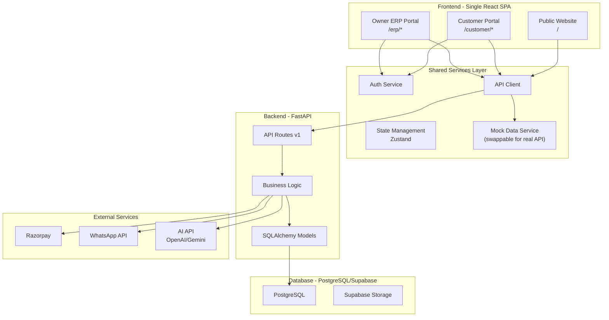

# Jayasree ERP AI — Implementation Plan

> **Enterprise-grade AI-powered ERP + B2B E-Commerce Platform**
> Company: Jayasree Enterprises | Industry: Steel, Cement, Construction Materials Trading

---

## Executive Summary

This plan covers building a **full-stack monorepo** containing three applications (Public Website, Customer Portal, Owner ERP Portal) with a shared FastAPI backend, PostgreSQL database, and AI assistant — all from scratch in an empty workspace.

> [!IMPORTANT]
> **This is a massive enterprise project.** To deliver a working, polished product, I'll build it in **6 phases**, each producing a deployable increment. I'll build all the frontend as a **single React SPA with route-based code splitting** (not a monorepo of separate apps) to maximize code reuse and minimize complexity.

---

## User Review Required

> [!WARNING]
> **Scope Reality Check:** A production ERP system of this scale (Zoho/Odoo caliber) typically takes teams of 20+ engineers 12-18 months. I will build a **fully functional, beautifully designed MVP** that demonstrates all modules with realistic mock data and simulated backend logic. Real payment gateway integration (Razorpay), real Supabase connections, and real AI API calls will require your API keys to be wired in post-build.

> [!IMPORTANT]
> **Tech Stack Confirmation:**
> - **Frontend:** Single Vite + React + TypeScript app with React Router for all 3 portals
> - **Styling:** Tailwind CSS + ShadCN UI components + Framer Motion animations
> - **Charts:** Recharts for analytics dashboards
> - **Backend:** FastAPI (Python) — will be scaffolded with full schema but the frontend will work standalone with mock data services
> - **Database:** PostgreSQL schema (SQL files) ready for Supabase deployment
> - **AI Assistant:** Chat UI with simulated AI responses (can be connected to OpenAI/Gemini API with your key)

---

## Open Questions

> [!IMPORTANT]
> 1. **Do you have a Supabase project already?** If yes, I can wire the connection. If not, I'll build with a mock data layer that can be swapped for Supabase later.
> 2. **Do you have a Razorpay account/test keys?** I'll build the payment UI regardless, but real integration needs your keys.
> 3. **Company branding:** Should I use a specific color scheme, or should I design one? I'll default to a premium dark theme with golden/amber accents (fitting for steel/construction industry).
> 4. **WhatsApp Business Number:** What number should the WhatsApp integration use? I'll use a placeholder for now.
> 5. **Do you want me to start building immediately** with mock data services, or wait for API keys?

---

## Architecture Overview



---

## Project Structure

```
jayasree-erp-ai/
├── frontend/                          # Vite + React + TypeScript
│   ├── public/
│   │   └── assets/                    # Static images, logos
│   ├── src/
│   │   ├── app/
│   │   │   ├── App.tsx                # Root with Router
│   │   │   └── providers.tsx          # Theme, Auth, Toast providers
│   │   │
│   │   ├── components/
│   │   │   ├── ui/                    # ShadCN components
│   │   │   ├── layout/               # Headers, Sidebars, Footers
│   │   │   ├── shared/               # Shared components (cards, tables, etc.)
│   │   │   └── charts/               # Recharts wrappers
│   │   │
│   │   ├── pages/
│   │   │   ├── public/               # Public website pages
│   │   │   │   ├── HomePage.tsx
│   │   │   │   ├── AboutPage.tsx
│   │   │   │   ├── ProductsPage.tsx
│   │   │   │   ├── ServicesPage.tsx
│   │   │   │   ├── GalleryPage.tsx
│   │   │   │   ├── ContactPage.tsx
│   │   │   │   └── RequestQuotePage.tsx
│   │   │   │
│   │   │   ├── auth/                  # Authentication pages
│   │   │   │   ├── LoginPage.tsx
│   │   │   │   ├── RegisterPage.tsx
│   │   │   │   ├── ForgotPasswordPage.tsx
│   │   │   │   └── OTPVerifyPage.tsx
│   │   │   │
│   │   │   ├── customer/             # Customer portal pages
│   │   │   │   ├── CatalogPage.tsx
│   │   │   │   ├── ProductDetailPage.tsx
│   │   │   │   ├── CartPage.tsx
│   │   │   │   ├── CheckoutPage.tsx
│   │   │   │   ├── OrdersPage.tsx
│   │   │   │   ├── PaymentsPage.tsx
│   │   │   │   ├── InvoicesPage.tsx
│   │   │   │   ├── ProfilePage.tsx
│   │   │   │   └── DashboardPage.tsx
│   │   │   │
│   │   │   └── erp/                   # Owner ERP pages
│   │   │       ├── DashboardPage.tsx
│   │   │       ├── inventory/
│   │   │       ├── customers/
│   │   │       ├── sales/
│   │   │       ├── suppliers/
│   │   │       ├── billing/
│   │   │       ├── reports/
│   │   │       ├── analytics/
│   │   │       └── ai-assistant/
│   │   │
│   │   ├── hooks/                     # Custom React hooks
│   │   ├── lib/                       # Utilities, helpers
│   │   ├── services/                  # API & mock data services
│   │   ├── stores/                    # Zustand state stores
│   │   ├── types/                     # TypeScript type definitions
│   │   └── data/                      # Mock/seed data
│   │
│   ├── index.html
│   ├── tailwind.config.ts
│   ├── tsconfig.json
│   ├── vite.config.ts
│   └── package.json
│
├── backend/                           # FastAPI Python
│   ├── app/
│   │   ├── api/v1/endpoints/
│   │   ├── core/
│   │   ├── models/
│   │   ├── schemas/
│   │   ├── services/
│   │   ├── db/
│   │   └── main.py
│   ├── requirements.txt
│   └── Dockerfile
│
├── database/                          # SQL Schema
│   ├── schema.sql
│   ├── seed.sql
│   └── migrations/
│
├── docker-compose.yml
└── README.md
```

---

## Phased Implementation

### Phase 1: Foundation & Public Website
**Estimated: ~200 files**

| Task | Details |
|------|---------|
| Project scaffolding | Vite + React + TS + Tailwind + ShadCN setup |
| Design system | Color palette, typography, spacing, animations |
| Layout components | Public header, footer, mobile nav |
| Home page | Hero, features, products showcase, testimonials, CTA |
| About page | Company story, team, mission, values |
| Products page | Steel/cement categories, product cards |
| Services page | Service offerings with icons |
| Gallery page | Photo gallery with lightbox |
| Contact page | Contact form, map, details |
| Request Quote page | Multi-step quote form |
| WhatsApp floating button | Global WhatsApp integration |
| SEO meta tags | Per-page title, description, OG tags |
| Responsive design | Mobile-first, all breakpoints |

---

### Phase 2: Authentication & Customer Portal
**Estimated: ~100 files**

| Task | Details |
|------|---------|
| Auth system | Login, Register, Forgot Password, OTP pages |
| Auth store | JWT token management, session persistence |
| Protected routes | Route guards for customer/ERP areas |
| Customer layout | Sidebar, header, breadcrumbs |
| Product catalog | Grid/list view, search, filters, sorting |
| Product details | Images, specs, reviews, stock status |
| Shopping cart | Add/remove/update, GST calculation |
| Checkout flow | Address, GST info, payment selection, summary |
| Payment UI | Razorpay integration placeholder |
| Customer dashboard | Orders, payments, invoices, profile |
| Order tracking | Order lifecycle visualization |
| Mock data layer | Realistic product/order/customer data |

---

### Phase 3: Owner ERP Dashboard & Inventory
**Estimated: ~120 files**

| Task | Details |
|------|---------|
| ERP layout | Collapsible sidebar, top bar, breadcrumbs |
| ERP dashboard | KPI cards, revenue charts, recent activity |
| Inventory module | Product master, stock in/out, adjustments |
| Warehouse management | Multi-warehouse tracking |
| Low stock alerts | Visual alerts with threshold configuration |
| Inventory valuation | FIFO/weighted average calculations |
| Data tables | Sortable, filterable, paginated tables |
| CRUD operations | Create, Read, Update, Delete for all entities |
| Role-based UI | Permission-based component rendering |

---

### Phase 4: Sales, Customers, Suppliers & Billing
**Estimated: ~100 files**

| Task | Details |
|------|---------|
| Customer management | Profile, orders, payments, balance, history |
| Sales management | Quotations, sales orders, invoices, returns |
| Supplier management | Details, POs, payment tracking, dues |
| Billing module | GST invoices, credit/debit notes |
| Ledger system | Customer & supplier ledgers |
| Payment tracking | Payment records, reconciliation |
| Invoice generation | PDF-ready invoice templates |

---

### Phase 5: Analytics, Reports & AI Assistant
**Estimated: ~80 files**

| Task | Details |
|------|---------|
| Analytics dashboard | Revenue, sales, profit, inventory trends |
| Interactive charts | Recharts with tooltips, drill-down |
| Report generation | Daily/weekly/monthly/quarterly/yearly |
| Export functionality | PDF, Excel, CSV export UI |
| AI Assistant UI | ChatGPT-style chat interface |
| AI conversation store | Message history, context management |
| Simulated AI responses | Smart responses based on data queries |
| Forecasting engine | Demand, sales, revenue forecast visualizations |
| Forecast charts | Time series with prediction bands |

---

### Phase 6: Backend & Database Schema
**Estimated: ~60 files**

| Task | Details |
|------|---------|
| PostgreSQL schema | Complete DDL for all 16+ tables |
| Seed data | Realistic demo data |
| FastAPI scaffolding | Project structure, config, auth |
| API endpoints | RESTful endpoints for all modules |
| Pydantic schemas | Request/response validation models |
| Service layer | Business logic separation |
| Docker setup | docker-compose for full stack |
| Documentation | API docs, deployment guide |

---

## Proposed Changes

### Frontend Application

#### [NEW] Project Configuration Files
- `package.json`, `vite.config.ts`, `tsconfig.json`, `tailwind.config.ts`
- ShadCN UI component configuration
- ESLint, PostCSS configuration

#### [NEW] Design System (`src/lib/`)
- Color palette: Dark theme with amber/gold accents (steel industry aesthetic)
- Typography: Inter + Outfit fonts from Google Fonts
- Animation presets for Framer Motion
- Utility functions (cn, formatCurrency, formatDate, etc.)

#### [NEW] Layout Components (`src/components/layout/`)
- `PublicHeader.tsx` — Transparent-to-solid navbar with mega menu
- `PublicFooter.tsx` — Multi-column footer with newsletter
- `CustomerSidebar.tsx` — Collapsible customer portal sidebar
- `ERPSidebar.tsx` — Full ERP navigation sidebar with role-based items
- `ERPHeader.tsx` — Search, notifications, user menu
- `WhatsAppButton.tsx` — Floating WhatsApp integration

#### [NEW] Public Website Pages (`src/pages/public/`)
- 7 pages with premium animations, glassmorphism cards, gradient CTAs

#### [NEW] Auth Pages (`src/pages/auth/`)
- 4 pages with split-screen layouts, animated backgrounds

#### [NEW] Customer Portal Pages (`src/pages/customer/`)
- 9 pages with e-commerce UX best practices

#### [NEW] ERP Portal Pages (`src/pages/erp/`)
- 15+ pages covering all ERP modules

#### [NEW] Mock Data Services (`src/services/`, `src/data/`)
- Realistic mock data for 50+ products, 20+ customers, 100+ orders
- Simulated API responses with configurable delays
- Data relationships matching real ERP schema

---

### Backend Application

#### [NEW] FastAPI Backend (`backend/`)
- Complete API structure with versioned endpoints
- JWT authentication middleware
- Pydantic schemas for all data models
- SQLAlchemy models for PostgreSQL
- Service layer for business logic

---

### Database

#### [NEW] PostgreSQL Schema (`database/schema.sql`)
All tables with UUID primary keys, timestamps, soft deletes:

| Table | Purpose |
|-------|---------|
| `users` | All system users (customers, staff, admin) |
| `roles` | Role definitions (owner, admin, manager, etc.) |
| `permissions` | Granular permission controls |
| `user_roles` | User-role mappings |
| `customers` | Customer business profiles |
| `suppliers` | Supplier details |
| `product_categories` | Category hierarchy |
| `products` | Product master data |
| `inventory` | Stock levels per warehouse |
| `warehouses` | Warehouse locations |
| `inventory_transactions` | Stock in/out/transfer log |
| `orders` | Customer orders |
| `order_items` | Order line items |
| `invoices` | GST invoices |
| `payments` | Payment records |
| `quotations` | Quote requests |
| `purchase_orders` | Supplier purchase orders |
| `purchase_order_items` | PO line items |
| `ledger_entries` | Accounting ledger |
| `notifications` | System notifications |
| `ai_conversations` | AI chat history |
| `ai_messages` | Individual AI messages |
| `audit_logs` | System audit trail |
| `forecast_data` | AI forecast results |

---

## Design Philosophy

### Visual Identity
- **Primary Colors:** Deep charcoal (#0F172A) + Rich amber (#F59E0B) + Steel blue (#3B82F6)
- **Style:** Premium dark mode with glassmorphism cards, gradient borders
- **Typography:** Inter (body) + Outfit (headings)
- **Animations:** Smooth page transitions, card hover effects, loading skeletons
- **Charts:** Custom-themed Recharts with gradient fills

### UI Inspiration
- **Dashboard:** Stripe Dashboard's clean data presentation
- **Sidebar:** Linear/Notion-style collapsible navigation
- **Tables:** Tanstack Table-style with advanced filtering
- **Cards:** Glassmorphism with subtle border gradients
- **Forms:** Multi-step wizards with progress indicators

---

## Verification Plan

### Automated Tests
```bash
# Build verification
cd frontend && npm run build

# TypeScript type checking
npx tsc --noEmit

# Lint checking
npm run lint
```

### Manual Verification
- Run `npm run dev` and visually verify all pages
- Test responsive design at mobile/tablet/desktop breakpoints
- Verify all navigation links work
- Test cart/checkout flow
- Verify ERP dashboard data rendering
- Test AI assistant chat interface
- Browser recording of key user flows

---

## Build Order (Execution Sequence)

1. **Scaffold project** → Vite + React + TS + Tailwind + ShadCN
2. **Design system** → Colors, fonts, animations, utilities
3. **Shared components** → UI primitives, layout shells
4. **Public website** → All 7 pages
5. **Auth system** → Login/Register + route guards
6. **Customer portal** → Catalog → Cart → Checkout → Dashboard
7. **ERP Dashboard** → KPIs + Charts
8. **ERP Inventory** → Product master + Stock management
9. **ERP Customers** → Customer management
10. **ERP Sales** → Orders, invoices, quotations
11. **ERP Suppliers** → Supplier management
12. **ERP Billing** → Accounting, ledgers, GST
13. **Analytics** → Charts, reports, exports
14. **AI Assistant** → Chat UI + simulated responses
15. **Forecasting** → Forecast visualizations
16. **Backend scaffold** → FastAPI + schema
17. **Database schema** → Complete PostgreSQL DDL
18. **Polish & verify** → Animations, responsive, testing
